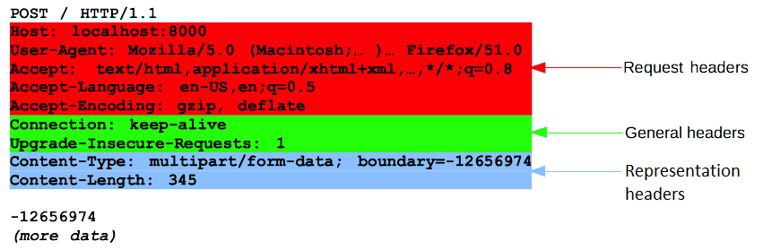
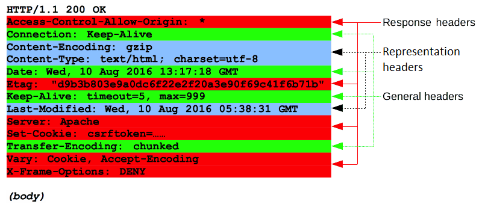
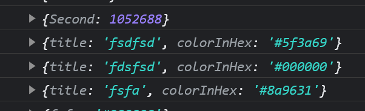

A start-line describing the requests to be implemented, or its status of whether successful or a failure. This start-line is always a single line.  
An optional set of HTTP headers specifying the request, or describing the body included in the message.  
A blank line indicating all meta-information for the request has been sent.
An optional body containing data associated with the request (like content of an HTML form), or the document associated with a response. The presence of the body and its size is specified by the start-line and HTTP headers.

request



response



```js
const newArray = [...titlesAndColors, { title, colorInHex }];
```

this will add two properties into it


if wannan add on properties like this

you should use

```js
const newArray={...titlesAndColors,{[title]:colorInhex}}
```

also,there is problem with rerender componet

this will not rerender

```js
const onNewColor = (title, colorInHex) => {
  let newArray = titlesAndColors;
  newArray.push({ title: colorInHex });
  setColors(newArray);
  console.log("add succeed");
  console.log(titlesAndColors);
};
```

this can

```js
const onNewColor = (title, colorInHex) => {
  const newArray = [...titlesAndColors, { [title]: colorInHex }];
  // Update the state using the new array
  setColors(newArray);
};
```
